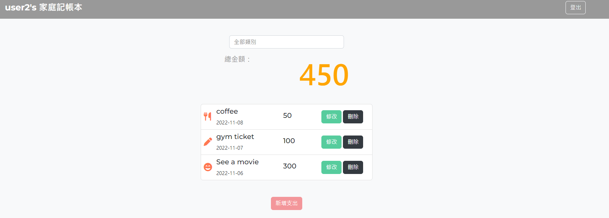

# 家庭記帳本 Expense-tracker - 簡介

可以用來記錄自己的每一筆消費名稱、金額、類別及日期。

登入後畫面


## 功能列表

### 登入及註冊頁面
- 使用者可以使用Email及密碼註冊新帳號，登入後亦可將帳號登出。

### 使用者登入帳號後
- 登入後畫面可顯示所有的消費總金額，並有每一筆消費的明細，如名稱、金額、類別的圖示及日期
- 可以透過消費類別搜尋同一個類別的總金額
- 可以新增消費
- 可以編輯已建立好的消費明細
- 可以刪除已建立好的消費

### 安裝與執行步驟

1. 請先確認有安裝 node.js 與 npm
2. 請將專案 clone 到本地，輸入：

   ```
   git clone https://github.com/miaout11/expense-tracker
   ```

3. 透過終端機移動至專案資料夾，輸入：

   ```
   npm install
   ```

4. 環境變數設置：

   參考.eve.example檔，新增一個.env檔案 

5. 增加種子資料，輸入：

   ```
   npm run seed
   ```

6. 開始執行程式，輸入：

   ```
   npm run start
   ```

7. 若終端機看見此行訊息則代表順利運行，打開瀏覽器進入到以下網址

   ```
   Listening on http://localhost:3000
   ```

8. 可透過以下兩個帳號進行測試

   ```
   User1
   email: user1@example.com
   password: 0123

   User2
   email: user2@example.com
   password: 0123
   ```

9. 結束使用

   ```
   ctrl + c  //結束程式
   ```

### 開發工具

- [Node.js 14.20.0](https://nodejs.org/en/)
- [Express 4.16.4](https://www.npmjs.com/package/express) -
- [Express-Handlebars 3.0.0](https://www.npmjs.com/package/express-handlebars)
- [Express-Session 1.17.1](https://www.npmjs.com/package/express-session)
- [Method-Override 3.0.0](https://www.npmjs.com/package/method-override)
- [passport](http://www.passportjs.org/)
- [MongoDB](https://www.mongodb.com/try/download/community2)
- [Mongoose 5.9.7](https://www.npmjs.com/package/mongoose)